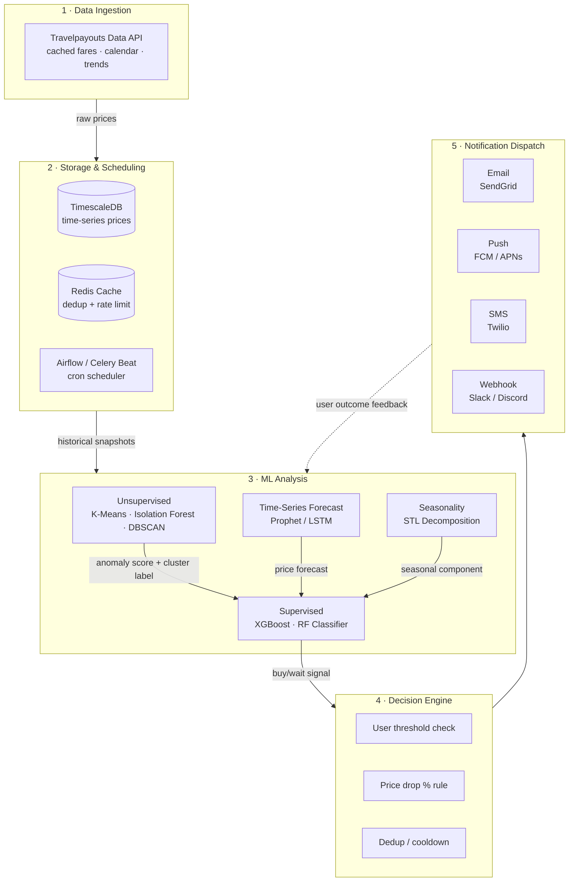

# Flight Price Notification System

Tracks flight prices via the Travelpayouts Data API, runs an ML pipeline to detect drops and predict trends, and delivers alerts through your preferred channel.

---

## Getting Started

```bash
pip install -r requirements.txt
cp .env.example .env   # then fill in TRAVELPAYOUTS_TOKEN
```

Get a token from [Travelpayouts](https://www.travelpayouts.com/programs/100/tools/api) (free, self-serve, no MAU gate).

Fetch a route's price snapshots directly from the command line:

```bash
# Rolling 4-month horizon, one-way + 7/14-day round-trip (see config/fetch.json)
python -m src.ingestion.fetch_snapshots DEL BOM

# Single month, for debugging
python -m src.ingestion.fetch_snapshots DEL BOM --depart-date 2026-09
```

This calls `src/ingestion/api_client.py` (Travelpayouts month-matrix,
prices-for-dates, latest, with calendar/cheap fallback) and
`src/ingestion/normalizer.py` (flattens responses into the internal
snapshot schema), printing the resulting snapshots as JSON.
`scheduler.py` will call `fetch_multi.run_fetch()` on a cron cadence
once storage (Phase 0) is wired up.

To fetch every route in `config/routes.json` and persist them, use
`fetch_multi.py`. Criteria live in `config/fetch.json` (horizon, trip
types, stay buckets, market). On every run it:

1. writes snapshots to `data/snapshots/<timestamp>.json` (audit log)
2. appends them, as a typed pandas `DataFrame`, to `data/snapshots.csv` — the ML-ready price-history file Phases 1-3 train against

```bash
python -m src.ingestion.fetch_multi
python -m src.ingestion.fetch_multi --horizon-months 4
python -m src.ingestion.fetch_multi --depart-date 2026-09   # optional single-month debug
```

Note: `data/snapshots.csv` stores plain text, so re-reading it later needs
`pd.read_csv(path, parse_dates=[...])` to restore the `datetime`/`category`
dtypes that `normalizer.snapshots_to_dataframe()` assigns before writing.

`origin`/`destination` are IATA codes (e.g. `DEL`, `BOM`). `snapshots_to_dataframe()`
also attaches `origin_city`/`destination_city` full names (e.g. "New Delhi",
"Mumbai") by joining against Travelpayouts' own reference data
(`src/ingestion/reference.py`, cached locally at `data/reference/cities.json`,
refreshed every 30 days). If the schema in `normalizer.py` ever changes again,
rebuild the CSV history from the raw JSON audit logs instead of hand-editing it:

```bash
python -m src.ingestion.rebuild_csv
```

---

## Project Structure

```
Flight_Price_NotificationSystem/
│
├── src/
│   ├── ingestion/
│   │   ├── api_client.py        # Travelpayouts Data API client (cheap / calendar / latest / month-matrix / prices_for_dates)
│   │   ├── reference.py         # Cached IATA code -> full city/airport name lookup (Travelpayouts static data)
│   │   ├── normalizer.py        # Flattens API responses -> list[dict]; list[dict] -> typed DataFrame/CSV
│   │   ├── fetch_snapshots.py   # CLI: rolling-horizon collector for a single route
│   │   ├── fetch_multi.py       # CLI: fetches config/routes.json + config/fetch.json, writes JSON audit log + CSV history
│   │   ├── rebuild_csv.py       # CLI: rebuilds data/snapshots.csv from data/snapshots/*.json after a schema change
│   │   └── scheduler.py        # Airflow / Celery Beat job definitions
│   │
│   ├── storage/
│   │   ├── schema.sql           # TimescaleDB hypertable + alert table definitions
│   │   ├── cache.py             # Redis — dedup, rate limiting, cooldown
│   │   └── repository.py       # CRUD — snapshots, alerts, predictions
│   │
│   ├── analysis/
│   │   ├── features.py          # Feature engineering from raw price snapshots
│   │   ├── seasonality.py       # STL decomposition — trend / season / residual
│   │   └── decision_engine.py   # Threshold rules + ML signal combiner
│   │
│   ├── ml/
│   │   ├── unsupervised.py      # K-Means, Isolation Forest, DBSCAN
│   │   └── supervised.py        # Prophet/LSTM forecast · XGBoost · RF classifier
│   │
│   └── notifications/
│       └── notifier.py          # Email · Push · SMS · Slack webhook dispatcher
│
├── .env.example
├── requirements.txt
└── README.md
```

---

## System Pipeline



---

## ML Learning Chain

The ML pipeline runs in three phases. **Each phase produces outputs that feed the next.**

---

### Phase 0 — Data Collection (no ML yet)

Rule-based threshold alerts fire from day 1. ML activates after ~4 weeks of price history.

| What gets stored | Fields |
|---|---|
| Per snapshot | origin, destination, departure date, airline, price, stops, timestamp |
| Fetch cadence | Every 6–12 hours per route |
| Data source | Travelpayouts Data API — free, self-serve, cached/aggregated fares (no MAU gate, unlike its live Aviasales Search API) |
| Key endpoints | `/v1/prices/calendar` (300 RPM) · `/v1/prices/latest` · `/aviasales/v3/get_latest_prices` |
| Rate limiting | Endpoint RPM caps are generous relative to a 6–12h polling cadence; Redis (`cache.py`) memoizes responses per route to stay well under limits and avoid redundant calls |
| Trade-off | Prices are cached/aggregated by Travelpayouts, not live shopping results — acceptable for trend/alert detection, not for guaranteeing bookable fares at the exact quoted price |

---

### Phase 1 — Unsupervised (runs from week 1, no labels needed)

Discovers structure in raw price history and flags anomalies before any labeling is done.

```
Raw Price History
       │
       ├──▶ K-Means Clustering
       │        Input   : per-route stats (mean, std, min, trend slope)
       │        Output  : cluster label ── "stable" | "volatile" | "seasonal"
       │
       ├──▶ Isolation Forest
       │        Input   : price snapshot vs route history
       │        Output  : anomaly score ── (−1 = drop detected, +1 = normal)
       │
       └──▶ DBSCAN
                Input   : price sequences per route
                Output  : outlier flag ── (−1 = structural outlier)
```

**Unlocks:** anomaly-triggered alerts immediately + cluster labels as features for Phase 2.

---

### Phase 1.5 — Seasonality Decomposition (runs alongside Phase 1)

Separates long-term trend from weekly/annual cycles before training any regressor.

```
Price Time Series
       │
       └──▶ STL Decomposition
                Splits into : Trend component  (long-run direction)
                            + Seasonal component (weekly / annual cycles)
                            + Residual  (noise — fed into Isolation Forest)
```

**Unlocks:** cleaner signal for Phase 2 regression; seasonal component becomes a standalone feature.

---

### Phase 2 — Supervised Regression (starts after ~4 weeks)

Predicts future price. Models are trained in sequence — each benchmark informs the next.

```
Engineered Features + Phase 1 cluster labels + STL components
       │
       ├──▶ Linear / Ridge Regression     (baseline)
       │        Predict : price in N days
       │        Why     : establishes a benchmark; fully interpretable
       │
       ├──▶ Prophet / LSTM                (time-series model)
       │        Predict : price trajectory over next 7–14 days
       │        Why     : captures sequential patterns and seasonal trends
       │
       └──▶ XGBoost Regressor             (primary model)
                Predict : price in N days
                Why     : best accuracy on tabular data; handles non-linearity
                Eval    : RMSE + time-based cross-validation folds
```

> Linear sets the floor. Prophet/LSTM captures the time dimension. XGBoost combines everything for the best point estimate.

**Unlocks:** predicted price as a feature for Phase 3 classification.

---

### Phase 3 — Supervised Classification (after Phase 2 predictions exist)

Answers one question: **Buy now or wait?**

```
Phase 2 Predictions + Full Feature Vector
       │
       ├──▶ Logistic Regression           (baseline)
       │        Classify : Buy (1) / Wait (0)
       │        Why      : simple decision boundary; interpretable probability
       │
       └──▶ Random Forest Classifier      (primary model)
                Classify : Buy (1) / Wait (0)
                Why      : robust to noisy price data; outputs calibrated probabilities
                Eval     : Precision · Recall · F1 on held-out time window
```

---

### Full Chain at a Glance

```
Phase 0          Phase 1               Phase 1.5         Phase 2            Phase 3
─────────        ─────────────────     ─────────────     ──────────────     ──────────────
Collect    ──▶   K-Means              STL Decompose ──▶ Linear Regression   Logistic Reg
4+ weeks         Isolation Forest ──▶ Trend/Season  ──▶ Prophet / LSTM  ──▶ RF Classifier
                 DBSCAN                                  XGBoost            Buy / Wait
                    │                                       │                    │
                    ▼                                       ▼                    ▼
              Anomaly Alerts                        Price Forecast         Decision Engine
              (fires week 1)                        (fires week 4+)        ──▶ Notify
```

| Phase | Category | Algorithms | When it fires |
|---|---|---|---|
| 1 | Unsupervised | K-Means, Isolation Forest, DBSCAN | Week 1 — no labels needed |
| 1.5 | Decomposition | STL | Week 1 — alongside Phase 1 |
| 2 | Supervised · Regression | Linear → Prophet/LSTM → XGBoost | After ~4 weeks of data |
| 3 | Supervised · Classification | Logistic Regression → RF Classifier | After Phase 2 predictions exist |

---

## Feature Engineering

| Feature | Why it matters |
|---|---|
| `days_until_departure` | Strongest signal — prices accelerate close to departure |
| `price_vs_route_average` | Normalizes across routes with different base costs |
| `price_vs_30d_min` | How close current price is to the historical floor |
| `rolling_7d_std` | Recent volatility — volatile routes behave differently |
| `stl_trend` | Long-run direction from STL decomposition |
| `stl_seasonal` | Weekly/annual cycle component from STL |
| `day_of_week` | Weekend vs weekday demand patterns |
| `month` / `season` | Annual demand cycles |
| `num_stops` | Direct vs connecting — structural price gap |
| `airline` (encoded) | Carrier-specific pricing strategies |
| `cluster_label` | Route behavior class from K-Means Phase 1 |

---

## Stack

| Layer | Technology |
|---|---|
| Flight Data API | Travelpayouts Data API (cached/aggregated fares, calendar, trends) |
| Time-Series DB | PostgreSQL + TimescaleDB |
| Cache | Redis (dedup, rate limiting, cooldown) |
| Scheduler | Airflow / Celery Beat |
| ML | scikit-learn · XGBoost · Prophet · statsmodels (STL) |
| Notifications | SendGrid · Twilio · FCM/APNs · Slack Webhook |
| Language | Python 3.11+ |
